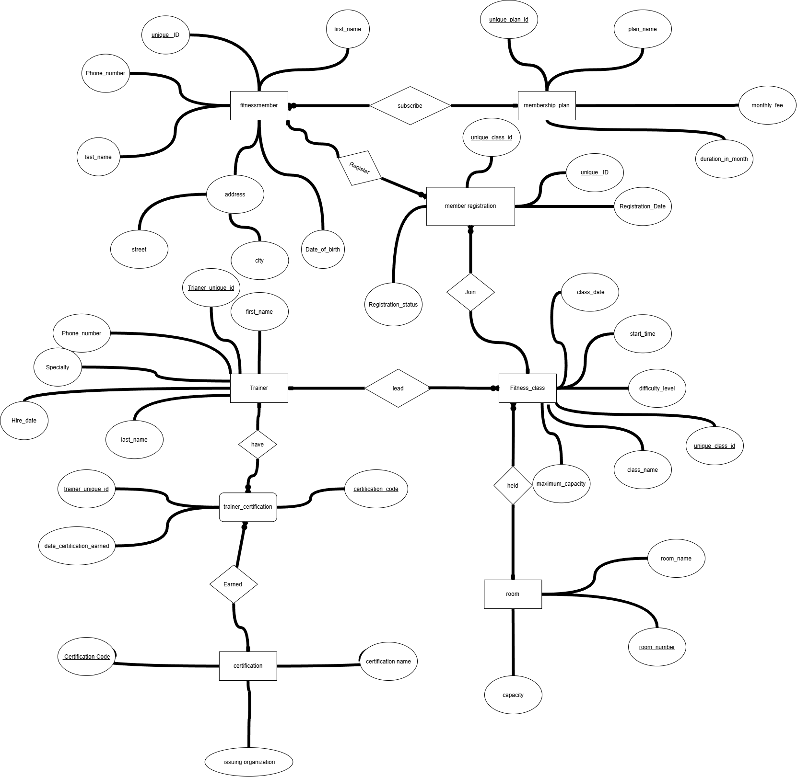

# FitZone DB

## How We Design ERD Diagram Design
1-Represent Entities in diagram and describe it by  attributes , define primary key for each entity 
2-connect entities to each other by relationship
3-define cardinalty and particibations  for relations
4- reshape associative entity many to many relationship just make a new entity to connect two entity togther (1 to many and many to one relationship)   and define composite primary key for each entity , pararell with solve problem optional to optional participation.

### Mapping Our ERD Diagram
1-Map Every entity into relation
2-Resolve many to many relation
3-Indentify PK
4-Indentify FK
5-Indicate Composite Primary Key

#### Using DBMS To Make A DB BY SQL(DDL)
1-Use Create To Define DB & Table
2-use Primary key Foreign key to define Keys
3-use not null for mandatory
4-check to get value > 0 
5- unique if business rule required 